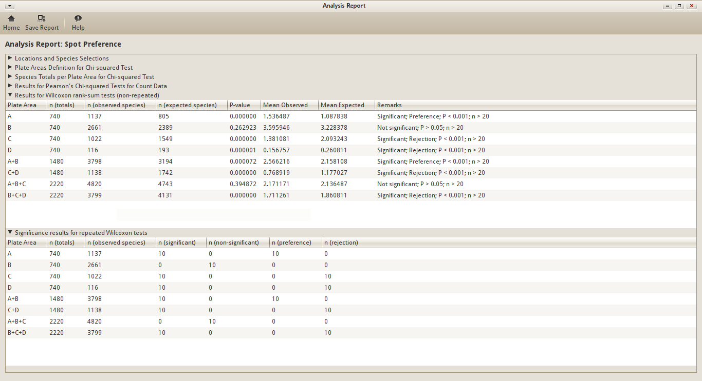
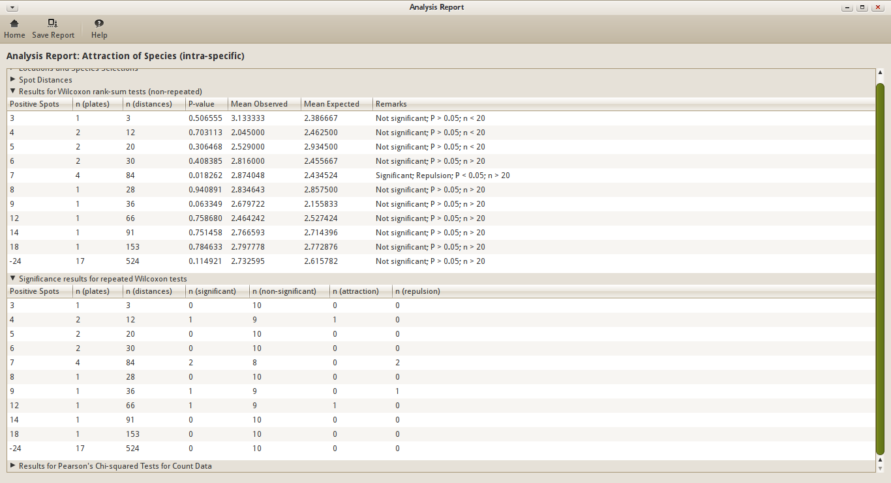

.. _usecases:

=====================
Use Cases for SETLyze
=====================

This document describes some possible use cases which describe how SETLyze
can be used to find answers to biological questions regarding the settlement
of species on SETL-plates.

.. _use-case-spot-preference:

Use Case 1: Spot Preference
###########################

Research Question
=================

"Do species of the genus *Obelia* have a preference for specific locations
on SETL-plates?"

Performing the analysis
=======================

Analysis "Spot preference" was designed to analyse a species' preference
for a specific location on a SETL-plates.

For this analysis, we can define the following hypotheses:

Null hypothesis
    The species in question settles at random areas of SETL-plates.

Alternative hypothesis
    The species in question has a preference for a plate area (observed mean
    > expected mean) or has a rejection for a plate area (observed mean <
    expected mean).

The analysis uses the P-value to decide which hypothesis is true.

P >= alpha level
    Assume that the null hypothesis is true.

P < alpha level
    Assume that the alternative hypothesis is true.

To find an answer to the research question, we're going to run the analysis
on all species of the genus *Obelia* from all available locations.

Start SETLyze, and from the :ref:`main window <dialog-analysis-selection>`
select "Analysis 1". Then click the OK button to start the selected analysis.
The :ref:`dialog-loc-selection` will now show up. If this is your first time
running SETLyze, then the list of locations will be empty. Clicking the
"Load Data" button opens the :ref:`dialog-load-data`. Use this dialog to load
your SETL data. For this example, we'll use the test data provided with
SETLyze.

.. note::

   On Windows, the test data can be found in the sub folder "test-data" of the
   directory to where you installed SETLyze (e.g.
   ``C:\Program Files\GiMaRIS\SETLyze\test-data\``).

   On Linux, the "test-data" folder can be found in the source package.

Once the SETL data is loaded, you should see a list of all locations. You can
now select the locations from which you want to select species. For this
example, we want to use all data available for the genus *Obelia*, so we'll
select all locations. Select a location and then press Ctrl+A to select all
locations. Press the Continue button.

The :ref:`dialog-spe-selection` should now be displayed. By default, the
species are sorted by their scientific name. Scroll down until you find the
species who's name start with *Obelia*. You should find the following six
species:

* *Obelia not geniculata*
* *Obelia geniculata*
* *Obelia dichotoma*
* *Obelia longissima*
* *Obelia bidentata*
* *Obelia sp.*

Select all six species by holding down the Shift key. Then press the Continue
button.

The :ref:`dialog-define-plate-areas` should now be displayed. This dialog
allows you to define the SETL-plate areas for the Chi-squared test. The result
of the Chi-squared test for this analysis is only useful if you have large
amounts of data for the species you're analyzing. Because the Wilcoxon test
for this analysis gives more specific information about the plate areas, we'll
focus on that instead. So we'll skip the details of this dialog, and leave the
default plate areas setting for the Chi-squared test. Press the Continue button
to start the calculations for this analysis.

In a few seconds you should be presented with the
:ref:`dialog-analysis-report`. This dialog shows the results for the analysis.
For this example, we'll skip the results of the Chi-squared test, and focus
on the results of the Wilcoxon tests.

Results
=======

You should see two sections for the results of the Wilcoxon test:

* :ref:`results-wilcoxon-rank-sum-test`
* :ref:`results-wilcoxon-repeated`

Click on both sections to reveal the results. You should see something similar
to the screenshot below.

   Analysis Report for Use Case 1

Let's first look at the results of the non-repeated tests. You can see that
there seems to be a strong preference for the corners of a SETL-plate (see
:ref:`fig_plate_areas_default` for an overview of the plate areas).
I say strong, because the P-value is very low (P < 0.1%). At the same time,
this species seems to reject the middle areas of the plates (areas C and D).
There is no significance for area B, so it makes sense that the combination
A+B returns significant preference. This significance is caused by area A, and
not B. The same can be said for B+C+D. The significance is caused by the areas
C+D. Area A+B+C returns non-significant. This is because both A and C have a
significance, but in the opposite directions. B has again no influence because
it's not significant.

Remember that these are the results of the non-repeated tests. The results
with very low P-values are pretty solid, even though the expected values
were calculated randomly. But this cannot be said for P-values that are
close to the alpha level (5% by default). In that case the significance result
could be a coincidence. This is why the results of repeated tests are included
as well.

The Wilcoxon test was repeated a number of times. And before each repeat, the
expected values are re-calculated. By default, the number of repeats is set to
10.

Let's have a look at the results of the repeated tests. If you look at the
repeat results for plate area A, you'll see that out of 10 repeats, 10 were
found to be significant (P < 5%). And out of these 10 significant results, all
10 showed a preference for the area. Based on this result, we can almost safely
say that the results we found are not a coincidence. I say almost, because
a total of 10 repeats is very low. To be even more sure, you can set the
number of repeats to a higher value in the :ref:`dialog-preferences`.

Conclusion
==========

The species of the genus *Obelia* have a strong preference for the corners
(area A) of SETL-plates, and a strong rejection for the middle (areas C+D) of
SETL-plates. The species don't seem to have a preference for the borders
(area B).

.. _use-case-attraction-intra:

Use Case 2: Attraction of Species (intra-specific)
##################################################

Research Question
=================

"Does *Balanus crenatus* from the location Aquadome Grevelingen attract
individuals of its own kind?"

Performing the analysis
=======================

Analysis "Attraction of Species (intra-specific)" can be used to determine
if a species attracts or repels individuals of its own kind.

For this analysis, we can define the following hypotheses:

Null hypothesis
    The species in question settles at random areas of SETL-plates, unregarded
    the presence of other individuals of its own kind.

Alternative hypothesis
    The species attracts (observed mean < expected mean) or repels
    (observed mean > expected mean) individuals of its own kind.

The analysis uses the P-value to decide which hypothesis is true.

P >= alpha level
    Assume that the null hypothesis is true.

P < alpha level
    Assume that the alternative hypothesis is true.

To find an answer to this research question, we're going to run the analysis
on *Balanus crenatus* from the location Aquadome Grevelingen.

Start SETLyze, and from the :ref:`main window <dialog-analysis-selection>`
select analysis "Attraction within Species". Then click the OK button to start
the selected analysis. The :ref:`dialog-loc-selection` will now show
up. If this is your first time running SETLyze, then the list of locations
will be empty. Clicking the "Load Data" button opens the
:ref:`dialog-load-data`. Use this dialog to load your SETL data. For this
example, we'll use the test data provided with SETLyze.

.. note::

   On Windows, the test data can be found in the sub folder "test-data" of the
   directory to where you installed SETLyze (e.g.
   ``C:\Program Files\GiMaRIS\SETLyze\test-data\``).

   On Linux, the "test-data" folder can be found in the source package.

Once the SETL data is loaded, you should see a list of all locations. You can
now select the locations from which you want to select species. For this
example, we're just interested in data from the location Aquadome Grevelingen.
Select "Aquadome, Grevelingen" from the list. Press the Continue button.

The :ref:`dialog-spe-selection` should now be displayed. By default, the
species are sorted by their scientific name. Select the species "*Balanus
crenatus*". Press the Continue button to start the calculations for this
analysis.

In a few seconds you should be presented with the
:ref:`dialog-analysis-report`. This dialog shows the results for the analysis.

Results
=======

For this analysis, two different statistical hypothesis tests are performed;
the Wilcoxon rank-sum test and Pearson's Chi-squared test. The following
sections should be present in the report dialog:

* :ref:`results-wilcoxon-rank-sum-test`
* :ref:`results-wilcoxon-repeated`
* :ref:`results-pearsons-chisq-test`

Let's first have a look at the results of the Wilcoxon tests. Click on both
Wilcoxon sections to reveal the results. You should see something similar
to the screenshot below.

   Analysis Report for Use Case 2 - Wilcoxon tests

Let's first look at the results of the non-repeated tests. You'll see that most
results are non-significant. There might be a few exceptions, but these could
have other causes then attraction/repuslion. For example, some parts of the
SETL-plates might be coverd with another species, making it simply impossible
for *Balanus crenatus* to settle there.

So these are the results of the non-repeated tests. The results
with very low P-values are pretty solid, even though the expected values
were calculated randomly. But this cannot be said for P-values that are
close to the alpha level (5% by default). In that case the significance result
could be a coincidence. This is why the results of repeated tests should be
taken into account as well.

The Wilcoxon test was repeated a number of times. And before each repeat, the
expected values are re-calculated. By default, the number of repeats is set to
10.

Let's have a look at the results of the repeated tests. Notice that sometimes
the test does return significant. If you however find that the test returns
non-significant far more often than significant, you could conclude that
there is no significance, and therefor assume that the null hypothesis is true.

Then there are the results of the Chi-squared tests. While the Wilcoxon test
looks at the distribution of spot distances (the measurements), the Chi-quared
test looks at the frequencies at which spot distances occur. The observed
frequencies are being compared to the expected frequencies. This again leads
to P-values which can be used to determine which hypothesis is true. Because
the expected values are fixed, repeats aren't necessary for this test.

.. figure:: report-usecase-2b.png
   :scale: 40 %
   :alt: Analysis Report for Use Case 2 - Chi-squared tests
   :align: center

   Analysis Report for Use Case 2 - Chi-squared tests

In this case, the Chi-squared test gives similar results to the Wilcoxon test.
It turns out however that this method is less sensitive to differences in
samples.

Conclusion
==========

*Balanus crenatus* doesn't seem to attract or repel individuals of its own
kind.
