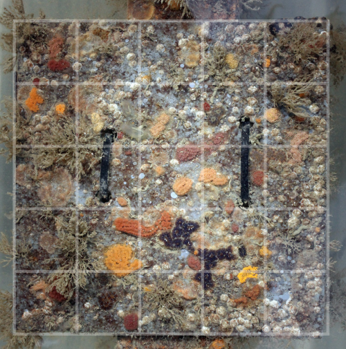
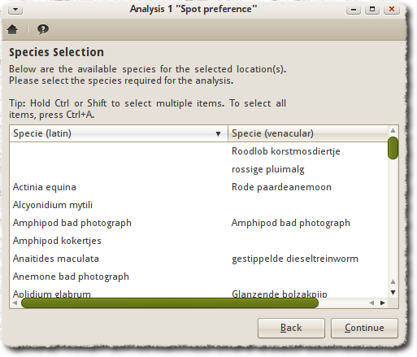
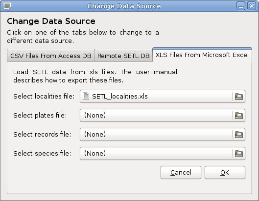
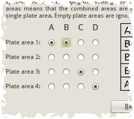
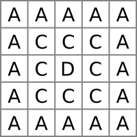
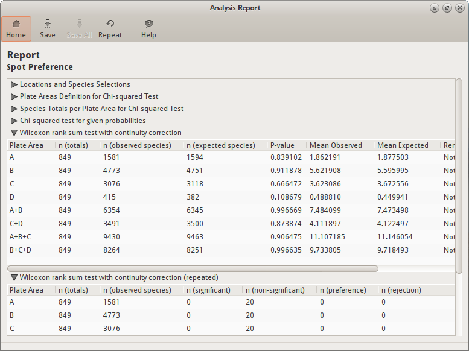
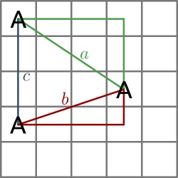

=========================================
SETLyze User Manual
=========================================

Welcome to the user manual for SETLyze. This manual explains the usage of
SETLyze.

-----------------------
Introduction to SETLyze
-----------------------

SETLyze is a part of the SETL project, a fouling community study focussing on
marine invasive species. The website describes the SETL project as follows:

    "Over the last ten years, marine invaders have had a dramatically
    increasing impact on temperate water ecosystems around the world.
    Substantial ecological and economical damage has been caused by the
    introduction of diseases, parasites, predators, invaders outcompeting
    native species, and species that are a nuisance for public health,
    tourism, aquaculture or in any other way. In the SETL-project
    standardized PVC-plates are used to detect these invasive species
    and other fouling community organisms. The material and methods of
    the SETL-project were developed by the ANEMOON foundation in
    cooperation with the Smithsonian Marine Invasions Laboratory of
    Smithsonian Environmental Research Centre. In this project 14x14
    cm PVC-plates are hung 1 meter below the water surface, and refreshed
    and checked for species at least every three months." ---
    `ANEMOON foundation <http://www.anemoon.org/>`_

Data collected from these SETL plates are stored in the SETL database. This
database currently contains over 25000 records containing information of over
200 species in different locations throughout the Netherlands. SETLyze is an
application capable of performing a set of analyses on this SETL data. SETLyze
can perform the following analyses:

*Spot Preference*
    Determine a species' preference for a specific location on a SETL plate.
    Species can be combined so that they are treated as a single species.

*Attraction within Species*
    Determine if a species attracts or repels individuals of its own kind.
    Species can be combined so that they are treated as a single species.

*Attraction between Species*
    Determine if two different species attract or repel each other. Species
    can be combined so that they are treated as a single species.

Additionally, any of the above analyses can be performed in batch mode, meaning
that the analysis is repeated for each species of a species selection. Thus
an analysis can be easily performed on an entire data set without intervention.
Batch mode for analyses are parallelized such that the computing power of a
computer is optimally used.


Data Collection
===============

First let's have a look at how the data for the SETL project is being
collected. When the SETL plates are checked, each plate is first
carefully pulled out of the water and then photographed. This is
done by a standard procedure described on the ANEMOON
foundation's website. First an overview photograph is taken of each
plate. Then some more detailed photographs are taken of the species
that grow on each plate. Indivdual plates are recognized by their tags.
The pictures are then carefully analyzed. For each plate the
SETL-monitoring form is filled in. For each species the absence or
presence, abundance and area cover are filled in. For this, a 5x5 grid
is digitally applied over the photograph (:ref:`fig_plate_with_grid`). For
each species the presence or absence on each of the 25 plate surfaces are
filled in and saved to the database.

.. _fig_plate_with_grid:



   SETL plate with digitally applied grid

Each record in the database contains a species ID, a plate ID, and
the 25 plate surfaces. The species ID links to the species that was found
on the plate. The plate ID links to the plate on which that species was
found. The plate ID is also linked to the location where this plate
was deployed. The 25 plate surfaces ("spots") are stored in each record
as booleans (meaning they can have a value of True or False). The value
1 (True) for a spot means that the species in question was present on
that spot of the plate. The value 0 (False) means that the species
was absent from that spot.

With 25 spots x 2500 records = 625000+ booleans for the presence/absence of
species, automatic methods of analyzing this data are required. Hence SETLyze
was developed, a tool for analyzing the settlement of species on SETL plates.

------------
Requirements
------------

To use SETLyze you will need:

Hardware

* Disk space:
    * SETLyze: 10 MB (source) / 30 MB (Windows setup)
    * R: 50 MB
* 512 MB RAM

Software

* Microsoft Windows or GNU/Linux

------------
Installation
------------

Microsoft Windows
===================

For Windows users, an installer is available that installs SETLyze together
with the pre-requisites (``setlyze-x.x-bundle-win32.exe``).

GNU/Linux
=========

For GNU/Linux users, a source package is available. The source package
doesn't contain SETLyze's dependencies. GNU/Linux user can use their
package manager to install the dependencies.

On Debian or derivatives, installing the dependencies can be done with the
following command ::

    sudo apt-get install python python-gtk2 python-rpy python-setuptools python-xlrd

System-wide install
-------------------

There is an INSTALL file in the source package. This file contains the
instructions for installing SETLyze on GNU/Linux systems.

Run from source directory
-------------------------

You can also just run SETLyze by (double) clicking ``setlyze.pyw`` in the
source directory. For this to work, ``setlyze.pyw`` needs to have execute
rights.

-------------
Using SETLyze
-------------

SETLyze comes with a graphical user interface (GUI). The GUI consists
of dialogs which all have a specific task. These dialogs will guide
you in performing the set of analyses it provides. Most of SETLyze's
dialogs have a Help button which when clicked should point you
to the corresponding dialog description on this page. All dialog
descriptions can be found in the :ref:`SETLyze dialogs <setlyze-dialogs>`
section of this manual.

Before SETLyze can perform an analysis it needs access to a data source
containing SETL data. Currently two data sources are supported: Text (*.csv)
or Excel (*.xls) files exported from the Microsoft Access SETL database. This
means that the user must first export the tables of the SETL database from
Microsoft Access to these files. This would result in four files, one for each
table. The user is then required to load these files into SETLyze. First follow
:ref:`the steps to export the SETL data <export-setl-data>`.

You can perform an analysis once you have loaded the four data files containing
the SETL data. Start SETLyze and you should be presented with the
:ref:`dialog-analysis-selection`. Select an
analysis and press OK to begin. A new dialog will be displayed, most likely the
:ref:`dialog-loc-selection`.

If this is your first time running SETLyze, the locations selection dialog will
show an empty locations list because no data has been loaded yet. To load SETL
data, click on the `Change Data Source` button to open the
:ref:`change data source dialog <dialog-load-data>`. This dialog
allows you to load data from CSV or XLS files exported from the Microsoft
Access SETL database.

Once the data has been loaded, the locations selection dialog will
automatically update the list of locations. From here on it's just a
matter of following the instruction one the screen. Should you need
more help, scroll down to the :ref:`setlyze-dialogs`
section for a more extensive description of each dialog. The dialog
descriptions are also accessible from SETLyze's dialogs itself by
clicking the Help button on a dialog.

Definition List
===============

This part of the user manual describes some terminology often used
throughout the application and this manual.

Intra-specific
    Within a single species.

Inter-specific
    Between two different species.

Plate area
    The defined area on a SETL plate. By default the SETL plate is divided in
    four plate areas (A, B, C and D). See :ref:`fig_plate_areas_default`.
    Plate areas can be combined, see :ref:`dialog-define-plate-areas`.

Positive spot
    Each record in the SETL database contains data for each of the 25
    spots on a SETL plate. The spots are stored as booleans, meaning
    they can have two values; 1 (True) means that the species was present
    on that spot, 0 (False) means that the species was absent on
    that spot. A spot is "positive" if the spot value is 1 or True. Each
    record can thus have up to 25 positive spots.

SETL plate
    In the SETL project standardized PVC-plates are used to detect invasive
    species and other fouling community organisms. In this project 14x14
    cm PVC-plates are hung 1 meter below the water surface, and refreshed
    and checked for species at least every three months.

Spot
    To analyze SETL plates, photographs of the plates are taken. The
    photographs are then analyzed on the computer by applying a 5x5
    grid to the photographs. This divides the SETL plate into 25 equal
    surface areas (see :ref:`fig_plate_with_grid`). Each
    of the 25 surface areas are called "spots". Species are scored for
    presence/absence for each of the 25 spots on each SETL plate, and the
    data is stored in the SETL database in the form of records. So each
    SETL record in the database contains presence/absence data of one
    species for all 25 spots on a SETL plate.

.. _setlyze-dialogs:

---------------
SETLyze dialogs
---------------

SETLyze comes with a graphical user interface consisting of separate
dialogs. The dialogs are described in this section.

.. _dialog-analysis-selection:

Analysis Selection dialog
=========================

.. figure:: dialog_select_analysis.png
   :scale: 100%
   :alt: Analysis Selection dialog
   :align: center

   Analysis Selection dialog

The analysis selection dialog is the first dialog you see when SETLyze
is started. It allows the user to select an analysis to perform on SETL
data. The user can select one of the analyses in the list and click on
the OK button to start the analysis. Clicking the Quit button closes
the application.

After pressing the OK button, two things can happen. If no SETL data was
found on the user's computer, SETLyze automatically tries to load SETL
locations and species data from the SETL database server. This requires
a direct connection with the SETL database server. A progress dialog is
shown while the data is being loaded. If connecting to the database server
fails, SETLyze continues without data. Since the database server has not been
implemented yet, no data will be loaded.

If SETL data is found on the user's computer, an information dialog is
displayed telling the user that existing data is being loaded.

Clicking the About button shows SETLyze's About dialog. The About dialog
shows general information about SETLyze; its version number, license
information, a link to the GiMaRIS website, the application developers,
and contact information.

Clicking the Preferences button loads the :ref:`dialog-preferences`.

.. _dialog-batch-mode:

Batch Mode dialog
=================

.. figure:: dialog_batch_mode.png
   :scale: 100%
   :alt: Batch Mode dialog
   :align: center

   Batch Mode dialog

Selecting "Batch mode" in the :ref:`dialog-analysis-selection` brings up the
Batch Mode dialog. This dialog allows you to start an analysis in batch
mode. In batch mode, the selected analysis is repeated for each species in a
species selection (or each inter species combination for analysis "Attraction
between Species"). When multiple species are selected the analysis is repeated
for each species separately and the results are displayed in a :ref:`summary-report`.
The summary report only displays the species that had significant results.

.. _dialog-preferences:

Preferences dialog
==================

.. figure:: dialog_preferences.png
   :scale: 100%
   :alt: Preferences dialog
   :align: center

   Preferences dialog

The preferences dialog allows you to change SETLyze's settings. Settings set
here are saved to a configuration file in the user's home directory
(~/.setlyze/setlyze.cfg). The following settings can be changed:

Alpha level (α) for statistical tests
    Sets the alpha level. The alpha level must be a number between 0 and 1.
    The default value ``0.05`` means an alpha level of 5%.

    This alpha level is translated to a confidence level with the formula
    :math:`conf. level = 1 - \alpha`. This confidence level is
    used for some statistical tests to calculate the confidence interval. At
    this moment this is just the t-test (not used in any analysis at this point).

    The alpha level is also used to determine if a P-value returned by
    statistical tests is considered significant. The P-value is considered
    significant if the P-value is equal or less than the alpha level.

    In the summary report for an analysis done in batch mode a result is only
    displayed if one of the statistical tests was considered significant. Some
    statistical tests are repeated (see next option) and the result for a
    repeated test is only considered significant if :math:`((1-\alpha)*100)\%`
    of the repeats resulted in a significant P-value. So with 20 repeats
    and :math:`\alpha = 0.05`, 19 out of 20 repeats (95%) must have had a
    significant P-value for the test result to be considered significant.

Number of repeats for statistical tests
    Sets the number of repeats to perform on some statistical tests. Some
    statistical tests used in SETLyze use expected values that are randomly
    generated. This means you can't draw a solid conclusion from the result
    of just one test. There is a change that the found result was a coincidence.
    To account for this, these test are repeated a number of times. The default
    value is 20 repeats. This value is very low, but good enough for testing
    purposes. When you need to draw solid conclusions, this value needs
    to be set to a higher number.

Number of concurrent processes for batch mode
    Batch mode for analyses are parallelized which means that multiple
    analyzes can be executed in parallel. The value set here corresponds to the
    number of concurrent processes that will execute analyses. The higher
    the number, the faster a batch analysis will complete. The number of
    processes must be at least 1 and no more than the number of CPUs. The
    default value of this option equals to 90% of the available CPUs.

.. _dialog-loc-selection:

Locations Selection dialog
==========================

.. figure:: dialog_locations_selection.png
   :scale: 100%
   :alt: Locations Selection dialog
   :align: center

   Locations Selection dialog

The locations selection dialog shows a list of all SETL locations. This
dialog allows you to select locations from which you want to select
species. The :ref:`dialog-spe-selection` (displayed after clicking the Continue
button) will only display the species that were recorded in the selected
locations. Subsequently this means that only the SETL records that match both
the locations and species selection will be used for the analysis, as each SETL
record is bound to a species and a SETL plate from a specific location.

The `Change Data Source` button opens the :ref:`dialog-load-data`.
This dialog allows you to load new SETL data. After doing so, the locations
selection dialog is automatically updated with the new data.

The Back button allows you to go back to the previous dialog. This can
be useful when you want to correct a choice you made in a previous dialog.

The Continue button saves the selection, closes the dialog, and shows the next
dialog.

Making a selection
------------------
Just click on one of the locations to select it. To select multiple
locations, hold Ctrl or Shift while selecting. To select all locations
at once, click on a location and press Ctrl+A.

.. _dialog-spe-selection:

Species Selection dialog
========================



   Species Selection dialog

The species selection dialog shows a list of all SETL species that were
found in the selected SETL locations. This dialog allows you to select
the species to be included in the analysis. Only the SETL records that
match both the locations and species selection will be used for the analysis.

It is possible to select more than one species (see `Making a selection`).
Selecting more than one species in a single species selection dialog means that
the selected species are threated as one species for the analysis. In batch
mode however, the analysis is repeated for each of the selected species.

If the selected analysis requires two or more separate species selections
(e.g. two species are compared), it will display the selection dialog multiple
times. In this case, the header of the selection dialog will say "First Species
Selection", "Second Species Selection", etc.

The Back button allows you to go back to the previous dialog. This can
be useful when you want to correct a choice you made in a previous dialog.

The Continue button saves the selection, closes the dialog, and shows the next
dialog.

Making a selection
------------------
Just click on one of the species to select it. To select multiple
species, hold Ctrl or Shift while selecting. To select all species
at once, click on a species and press Ctrl+A.

.. _dialog-load-data:

Load Data dialog
================



   Load Data dialog

The Load Data dialog allows you to load SETL data into SETLyze. Two data
sources are supported:

* Text CSV (\*.csv, \*.txt) files exported from the Microsoft Access SETL
  database. The CSV files need to be exported by Microsoft Access, one file
  for each of the four tables: SETL_localities, SETL_plates, SETL_records, and
  SETL_species. The section :ref:`export-setl-data` describes how to export
  these files.

* Excel 97/2000/XP/2003 (\*.xls) files exported from the Microsoft Access SETL
  database. One file for each of the four tables: SETL_localities, SETL_plates,
  SETL_records, and SETL_species. Microsoft Access by default includes a header
  row in the exported XLS files. The header row must be removed before
  importing into SETLyze.

After selecting all four data files files, press the OK button to load the
SETL data from these files. A progress dialog is shown while the data
is being loaded. Once the data has been loaded, the :ref:`dialog-loc-selection`
will be updated with the new data.

.. _dialog-define-plate-areas:

Define Plate Areas dialog
=========================

.. figure:: dialog_define_plate_areas.png
   :scale: 100%
   :alt: Define Plate Areas dialog
   :align: center

   Define Plate Areas dialog

This dialog allows you to define the plate areas for analysis "Spot
Preference". By default, the SETL plate is divided in four plate areas: A, B,
C and D. This dialog allows you to combine these areas by changing the area
definitions. Combining areas means that the combined areas are treated as a
single plate area. One must define at least two plate areas.

The user defined plate areas are only used for the Chi-squared test. In any
case the Wilcoxon test will analyze the plate areas A, B, C, D, A+B, C+D, A+B+C
and B+C+D.

Below is a schematic SETL plate with a grid. By default the plate is
divided in four plate areas (A, B, C and D),

.. _fig_plate_areas_default:

.. figure:: plate_areas_default.png
   :scale: 100%
   :alt: Default plate areas
   :align: center

   Default plate areas

But sometimes it's useful to combine plate areas. So if one decides
to combine areas A and B, the selection could be changed as follows,



   Combined plate areas selection

And the resulting plate areas definition would look something like this,



   Plate areas A and B combined.

This would result in three plate areas. Analysis "Spot Preference" would then
determine if the selected species has a preference for either of the three
plate areas.

The names of the plate areas (area 1, area 2, ...) do not have a
special meaning. It is simply used internally by the application to
distinguish between plate areas. These area names are also used in the
analysis report to distinguish between the plate areas.

The Back button allows you to go back to the previous dialog. This can
be useful when you want to correct a choice you made in a previous
dialog.

The Continue button saves the selection, closes the dialog, and shows the next
dialog.

.. _dialog-analysis-report:

Analysis Report dialog
======================



   Analysis Report dialog

The analysis report dialog shows the results for an analysis. The dialog
consists of the results frame and a toolbar on top. The toolbar holds a number
of buttons. Hover your mouse pointer over the buttons to reveal a tooltip which
explains the button's action. Some buttons are explained below:

Save
    The "Save" button allows you to save the report to a file. Clicking
    this button first shows a File Save dialog which allows you to select a
    target directory and filename. One file type is supported:

    * reStructuredText (\*.rst) - Plain text files in an easy-to-read markup
      syntax. One can use `Docutils <http://docutils.sourceforge.net/>`_ to
      convert `reStructuredText <http://docutils.sourceforge.net/rst.html>`_
      files into useful formats, such as HTML, LaTeX, man-pages, open-document
      or XML.

Save All
    The "Save All" button is only enabled in batch mode and allows you to export
    the reports of the individual analyses. Clicking the "Save" button in batch
    mode only saves the :ref:`summary-report` which is based on the
    :ref:`individual <standard-report>` reports.

Repeat
    The "Repeat" button can be used to repeat an analysis with different
    parameters. Clicking this button will open a dialog which shows the same
    parameters available in the :ref:`dialog-preferences`. So one can, for
    example, quickly repeat the analysis with a different number of repeats.

The report dialog can display two types of reports:

* :ref:`standard-report`: When running an analysis in standard mode (not in
  batch mode) the report is divided into sections. There is a section for each
  statistical test that was performed.
* :ref:`summary-report`: When running an analysis in batch mode the report will
  be a summary of all standard reports that were generated. This report will
  show less details than a standard report.

Both types of reports will be explained below.

.. _standard-report:

Standard Report
---------------

A standard report is divided into subsections. You have to click on a
subsection to reveal its contents. Find the explanation for each subsection
below.

Locations and Species Selections
````````````````````````````````

Displays the locations and species selections. If multiple selections
were made, each element is suffixed by a number. For example "Species
selection (2)" stands for the second species selection.

Spot Distances
``````````````

Displays the observed and expected spot distances. How these distances
are calculated is described below.

Observed spot distances (intra)
'''''''''''''''''''''''''''''''

All possible distances between the spots on each plate are calculated
using the Pythagorean theorem. Consider the case of species A and the
following plate:



   Spot distances on SETL plate (intra)

As you can see from the figure, three positive spots results in three
spot distances (*a*, *b* and *c*). The distance from one spot to the next
by moving horizontally or vertically is defined as 1. The distances from
the figure are calculated as follows:

| :math:`spot\_distance(a) = \sqrt{3^2 + 2^2} = 3.61`
| :math:`spot\_distance(b) = \sqrt{3^2 + 1^2} = 3.16`
| :math:`spot\_distance(c) = \sqrt{0^2 + 3^2} = 3`

This is done for all possible spot distances on each plate. Note that
there can be no distance 0 (in contrast to inter-specific spot
distances).

Observed spot distances (inter)
'''''''''''''''''''''''''''''''

First the plate records are collected that contain both of the selected
species. Then all possible spot distances are calculated between the
two species. The following figure shows an example with positive spots
for two species (A and B) and all possible spot distnaces.

.. _fig_spot-distances-inter:

.. figure:: setl_plate_inter_distances.png
   :scale: 100%
   :alt: Spot distances on SETL plate (inter)
   :align: center

   Spot distances on SETL plate (inter)

In the above figure, the distances are calculated the same way as for
analysis "Attraction within Species". Note however that only inter-specific distances are
calculated (distances between two different species). This also makes it
possible to have a distance of 0 as visualized in the next figure.

.. _fig_spot-distances-inter2:

.. figure:: setl_plate_inter_distances2.png
   :scale: 100%
   :alt: Spot distances on SETL plate (inter)
   :align: center

   Spot distances on SETL plate (inter)

The distances for this figure are calculated as follows:

| :math:`spot\_distance(a) = \sqrt{0^2 + 0^2} = 0`
| :math:`spot\_distance(b) = \sqrt{3^2 + 1^2} = 3.16`
| :math:`spot\_distance(c) = \sqrt{0^2 + 2^2} = 2`

Expected spot distances
'''''''''''''''''''''''

The expected spot distances are calculated by generating a copy of
each plate record matching the species selection. Each copy has the
same number of positive spots as its original, except the positive
spots are placed randomly at the plates. Then the spot distances
are calculated the same way as for the observed spot distances. This
means that the resulting list of expected spot distances has the same
length as the observed spot distances.

.. _results-wilcoxon-rank-sum-test:

Wilcoxon rank sum test with continuity correction
`````````````````````````````````````````````````

Shows the results for the non-repeated Wilcoxon rank-sum tests.

    "In statistics, the Mann–Whitney U test (also called the
    Mann–Whitney–Wilcoxon (MWW) or Wilcoxon rank-sum test) is a non-parametric
    statistical hypothesis test for assessing whether two independent samples
    of observations have equally large values." ---
    `Mann–Whitney U (Wikipedia. 6 December 2010) <http://en.wikipedia.org/wiki/Mann-Whitney-Wilcoxon_test>`_

Tests showed that spot distances on a SETL plate are not normally
distributed (see :ref:`testing_spot_distances_normality`), hence the Wilcoxon
rank-sum test for unpaired data was chosen to test if observed and expected
spot distances differ significantly. The observed and expected spot distances

Depending on the analysis, the test is performed on different groups of data.
The data can be grouped by plate area (analysis "Spot Preference"), the number
of positive spots (analysis "Attraction within Species") or by positive spot
ratios groups (analysis "Attraction between Species"). See section :ref:`record
grouping <record-grouping>` for more information on data grouping.

Each row for the results of the Wicoxon test contains the results of a single
test on a data group. Each row can have the following elements:

Plate Area
    The plate area of a SETL plate. A SETL plate is divided into four plate
    areas: A, B, C, and D (see :ref:`fig_plate_areas_default`). The test is
    performed on each of the four plate areas, plus the combinations "A+B",
    "C+D", "A+B+C", and "B+C+D". Combining the results of the test for all
    plate areas (and combinations) allows you to make conclusions about the
    species' preference for areas on SETL plates. See also
    :ref:`record-grouping-plate-area`.

Positive Spots
    A number representing the number of positive spots. For this test only
    records matching that number of positive spots were used. See also
    :ref:`record-grouping-positive-spots`.

Ratios Group
    A number representing the ratios group. For this test only records grouped
    in that ratios group were used. See also
    :ref:`record-grouping-ratio-groups`.

n (totals)
    The number of values (n) used for the statistical test. Each value (x) is a
    number representing the number of encounters of a species on a plate area
    for a specific record in the database. So a value ``x=4`` means that the
    species was found on four spots of the area in question for a specific
    plate. If the area in question was "A", then the maximum value for x would be
    4, because area "A" consists of four spots. This is done for all records
    matching that species and plate area, resulting in a sequence of numbers
    (e.g. ``1,0,0,3,12,4,8,0,...``). So n is the number of values x.

n (observed species)
    The number of times the species was found on the plate area in question.
    This is for all plates summed up.

n (expected species)
    The number of times you'd expect the species to be found on the plate
    area in question. The expected values are calculated per plate with
    a random generator. For each plate, the same number of positive spots
    are generated randomly on a virtual plate. The number of positive spots
    are then counted for the plate area in question.

n (plates)
    The number of plates that match the number of positive spots.

n (distances)
    The number of spot distances derived from the records matching the
    positive spots number.

P-value
    The P-value for the test.

Mean Observed
    The mean of the observed spot distances. This is calculated separately.

Mean Expected
    The mean of the expected spot distances. This is calculated separately.

Remarks
    A summary of the results. Shows whether the p-value is significant
    (p-value <= alpha level), and if so, how significant and decides based on
    the means if the species attract species/reject a plate area
    (observed mean < expected mean) or repel species/prefer a plate area
    (observed mean > expected mean).

Some data groups might me missing from the list of results. This is because
groups that don't have matching records are skipped, so they are not displayed
in the list of results.

.. _results-wilcoxon-repeated:

Wilcoxon rank sum test with continuity correction (repeated)
````````````````````````````````````````````````````````````

Shows the significance results for the repeated Wilcoxon tests. For more
information about the Wilcoxon rank-sum test results, see
:ref:`results-wilcoxon-rank-sum-test`.

The number of repeats to perform can be set in the :ref:`dialog-preferences`.

Each row for the results of the repeated Wicoxon test contains the results of
repeated tests on a data group. Each row can have the following elements:

Plate Area
    See description for :ref:`results-wilcoxon-rank-sum-test`.

n (totals)
    See description for :ref:`results-wilcoxon-rank-sum-test`.

n (observed species)
    See description for :ref:`results-wilcoxon-rank-sum-test`.

n (significant)
    Shows how many times the test turned out significant for the repeats
    (P-value <= alpha level).

n (non-significant)
    Shows how many times the test turned out to be not significant for the
    repeats (P-value > alpha level).

n (preference)
    Shows how many times there was a significant preference for the plate
    area in question.

n (rejection)
    Shows how many times there was a significant rejection for the plate
    area in question.

n (attraction)
    Shows how many times there was a significant attraction for the species in
    question.

n (repulsion)
    Shows how many times there was a significant repulsion for the species in
    question.

.. _results-pearsons-chisq-test:

Chi-squared test for given probabilities
````````````````````````````````````````

Shows the results for Pearson's Chi-squared Test for Count Data.

    "Pearson's chi-square (χ2) test is the
    best-known of several chi-square tests. It tests a null hypothesis
    stating that the frequency distribution of certain events observed
    in a sample is consistent with a particular theoretical distribution."
    --- `Pearson's Chi-squared Test (Wikipedia. 23 December 2010) <http://en.wikipedia.org/wiki/Pearson's_chi-square_test>`_

The observed values are the frequencies of the observed spot distances. The
expected values are calculated with the formula :math:`e(d) = N * p(d)`
where *N* is the total number of observed distances and *p* is the
probability for spot distance *d*. The probability *p* has been
pre-calculated for each spot distance. The probabilities for intra-specific
spot distances are from the model of :ref:`fig_distance_distribution_intra`
and the probabilities for inter-specific distances are from the model of
:ref:`fig_distance_distribution_inter`. The probabilities have been hard coded
into the application:

Intra-specific spot distances:

=============  ===========
Spot Distance  Probability
=============  ===========
1              40/300
1.41           32/300
2              30/300
2.24           48/300
2.83           18/300
3              20/300
3.16           32/300
3.61           24/300
4              10/300
4.12           16/300
4.24           8/300
4.47           12/300
5              8/300
5.66           2/300
=============  ===========

Inter-specific spot distances:

=============  ===========
Spot Distance  Probability
=============  ===========
0              25/625
1              80/625
1.41           64/625
2              60/625
2.24           96/625
2.83           36/625
3              40/625
3.16           64/625
3.61           48/625
4              20/625
4.12           32/625
4.24           16/625
4.47           24/625
5              16/625
5.66           4/625
=============  ===========

Depending on the analysis, the records matching the species selection are first
grouped by positive spots number (analysis "Attraction within Species") or by
ratios group (analysis "Attraction between Species"). See section
:ref:`record-grouping`.

Each row for the results of the Chi-squared tests contains the results of a
single test on a spots/ratios group. Each row can have the following elements:

Positive Spots
    A number representing the number of positive spots. For this test
    only records matching that number of positive spots were used.

Ratios Group
    A number representing the ratios group. For this test
    only records grouped in that ratios group were used.

n (plates)
    The number of plates that match the number of positive spots.

n (distances)
    The number of spot distances derived from the records matching the
    positive spots number.

P-value
    The P-value for the test.

Chi squared
    The value the Chi-squared test statistic.

df
    The degrees of freedom of the approximate chi-squared distribution
    of the test statistic.

Mean Observed
    The mean of the observed spot distances. This is calculated separately.

Mean Expected
    The mean of the expected spot distances. This is calculated separately.

Remarks
    A summary of the results. Shows whether the p-value is significant,
    and if so, how significant and decides based on the means if the
    species attract (observed mean < expected mean) or repel
    (observed mean > expected mean).

Some spots/ratios groups might me missing from the list of results. This is
because spots/ratios groups that don't have matching records are skipped,
so they are not displayed in the list of results.

.. _plate-areas-definition:

Plate Areas Definition for Chi-squared Test
```````````````````````````````````````````

Describes the definition of the plate areas set with the
:ref:`dialog-define-plate-areas`. See the description for that dialog to get
the meaning of the letters A, B, C and D.

Species Totals per Plate Area for Chi-squared Test
``````````````````````````````````````````````````

Area ID
    See the :ref:`plate-areas-definition` section of the report to see the
    definition of each area.

Observed Totals
    How many times the selected species was found present in each of
    the plate areas.

Expected Totals
    The expected totals for the selected species.

.. _summary-report:

Summary Report
--------------

A summary report contains basic information from multiple
:ref:`standard reports <standard-report>`. Such a summary report is basically
a table where each row represents a single analysis and the columns contain
the results. A summary report also has separate sections for analysis
information and a definition list for the codes used in the summary report.

Here are a few examples of summary reports:

Analysis "Spot Preference":

==================================================  ==============================  ==============================  ==============================  ==============================  ==============================  ==============================  ==============================  ==============================  ==============================  ==============================
..                                                                                                                                                                                                      Wilcoxon rank sum test                                                                                                                                  Chi-sq
----------------------------------------------------------------------------------  --------------------------------------------------------------------------------------------------------------------------------------------------------------------------------------------------------------------------------------------------------------  ------------------------------
Species                                                                 n (plates)                               A                               B                               C                               D                             A+B                             C+D                           A+B+C                           B+C+D                         A,B,C,D
==================================================  ==============================  ==============================  ==============================  ==============================  ==============================  ==============================  ==============================  ==============================  ==============================  ==============================
*Obelia dichotoma*                                                             177                    pr; p=0.0000                    ns; p=1.0000                    rj; p=0.0000                    ns; p=0.0500                    ns; p=0.3500                    rj; p=0.0000                    ns; p=1.0000                    ns; p=1.0000          s; χ²=103.98; p=0.0000
*Obelia geniculata*                                                             91                    ns; p=0.4500                    ns; p=1.0000                    rj; p=0.0000                    ns; p=0.1000                    ns; p=1.0000                    rj; p=0.0000                    ns; p=1.0000                    ns; p=1.0000           s; χ²=62.30; p=0.0000
*Obelia longissima*                                                            341                    pr; p=0.0000                    ns; p=1.0000                    rj; p=0.0000                    rj; p=0.0000                    pr; p=0.0000                    rj; p=0.0000                    ns; p=1.0000                    rj; p=0.0000          s; χ²=435.22; p=0.0000
==================================================  ==============================  ==============================  ==============================  ==============================  ==============================  ==============================  ==============================  ==============================  ==============================  ==============================

In the above example the columns containing letters (A,B,..) represent plate
areas. See :ref:`record-grouping-plate-area`.

Analysis "Attraction between Species":

==================================================  ==================================================  ==============================  ==============================  ==============================  ==============================  ==============================  ==============================  ==============================  ==============================  ==============================  ==============================  ==============================  ==============================  ==============================
..                                                                                                                                                                                                                          Wilcoxon rank sum test                                                                                                                                                                             Chi-squared test
--------------------------------------------------------------------------------------------------------------------------------------  ----------------------------------------------------------------------------------------------------------------------------------------------------------------------------------------------  ----------------------------------------------------------------------------------------------------------------------------------------------------------------------------------------------
Species A                                           Species B                                                               n (plates)                             1-5                               1                               2                               3                               4                               5                             1-5                               1                               2                               3                               4                               5
==================================================  ==================================================  ==============================  ==============================  ==============================  ==============================  ==============================  ==============================  ==============================  ==============================  ==============================  ==============================  ==============================  ==============================  ==============================
*Obelia dichotoma*                                  *Obelia geniculata*                                                             12                    ns; p=0.8500                    ns; p=0.0500                    at; p=0.0000                    ns; p=1.0000                              na                              na          ns; χ²=16.90; p=0.2615          rp; χ²=35.36; p=0.0013          at; χ²=38.12; p=0.0005           ns; χ²=7.21; p=0.9263                              na                              na
*Obelia dichotoma*                                  *Obelia longissima*                                                             81                    rp; p=0.0000                    ns; p=0.1000                    rp; p=0.0000                    rp; p=0.0000                    rp; p=0.0000                    rp; p=0.0000         rp; χ²=420.68; p=0.0000         rp; χ²=134.34; p=0.0000         rp; χ²=164.86; p=0.0000         rp; χ²=170.01; p=0.0000          rp; χ²=96.88; p=0.0000          rp; χ²=43.53; p=0.0001
*Obelia geniculata*                                 *Obelia longissima*                                                             39                    rp; p=0.0000                    ns; p=0.9500                    ns; p=0.9500                    ns; p=0.5500                    ns; p=0.9500                    rp; p=0.0000         rp; χ²=211.92; p=0.0000          rp; χ²=39.46; p=0.0003          rp; χ²=28.69; p=0.0115         rp; χ²=105.26; p=0.0000           ns; χ²=8.14; p=0.8821         rp; χ²=141.94; p=0.0000
==================================================  ==================================================  ==============================  ==============================  ==============================  ==============================  ==============================  ==============================  ==============================  ==============================  ==============================  ==============================  ==============================  ==============================  ==============================

In this example the columns containing numbers (1,2,..) represent positive
spot ratio groups. See :ref:`record-grouping-ratio-groups`.

For analysis "Attraction within Species" (no example here) the columns also
contain numbers (2,3,..), but in that case they represent positive
spot numbers. See :ref:`record-grouping-positive-spots`.

Definitions
```````````

Below are the definitions for the codes used in summary reports.

na
  There is not enough data for the analysis or in case of the
  Chi Squared test one of the expected frequencies is less than 5.

s
  The result for the statistical test was significant.

ns
  The result for the statistical test was not significant.

pr
  There was a significant preference for the plate area in question.

rj
  There was a significant rejection for the plate area in question.

at
  There was a significant attraction for the species in question.

rp
  There was a significant repulsion for the species in question.

.. _record-grouping:

Record Grouping
===============

SETLyze performs statistical tests to determine the significance of
results. The key statistical tests used to determine significance are
the Wilcoxon rank-sum test and Pearson's Chi-squared test. The tests
are performed on records data that match the locations and species
selection. It is however not a good idea to just perform the test
on all matching records. For this reason the matching records are first
grouped by a specific property. The tests are then performed on each
group.

Two methods for grouping records have been implemented. One is by positive
spots number, and the other is by positive spots ratio. We'll describe
each grouping method below.

.. _record-grouping-plate-area:

Grouping by Plate Area
----------------------

This type of grouping is done for analysis "Spot Preference". Each group
is a plate area or a combination of plate areas (see
:ref:`fig_plate_areas_default`). The following groups are defined:

#. Plate area A
#. Plate area B
#. Plate area C
#. Plate area D
#. Plate area A+B
#. Plate area B+C
#. Plate area A+B+C
#. Plate area B+C+D

For each group, the number of positive spots for all plates and that specific
plate area are calculated. These make up the observed values.

.. _record-grouping-positive-spots:

Record grouping by number of positive spots
-------------------------------------------

This type of grouping is done in the case of calculated spot distances
for a single species (or multiple species grouped together) on SETL
plates (analysis "Attraction within Species").

A record has a maximum of 25 positive spots, so this results in a
maximum of 25 record groups. Group 1 contains records with just one
positive spot, group 2 contains records with two positive spots, et
cetera. Records of group 1 and 25 are left out however. Group 1 is
skipped because it is not possible to calculate spot distances for
records with just one positive spot. And group 25 is excluded because
a significance test on records of this group will always result in a
p-value of 1. This makes sense, because both the observed and expected
distances are based on records with 25 positive spots, which is a full
SETL plate. As a result, the observed and expected spot distances will
be exactly the same.

The test is also performed on a group with number -24. Of course there
is no such thing as records with minus 24 positive spots. Actually, the
minus sign should be read as "up to". So this test is also performed on
records with up to 24 positive spots. This means that the significance
test will also be performed on records of all groups together. Note
that records of group 1 will still be ignored.

The results of the significance tests are presented in rows. Each row
contains the result of the test for one group. The "Positive Spots"
column tells you to which group each result belongs.

.. _record-grouping-ratio-groups:

Record grouping by ratios groups
--------------------------------

This type of grouping is done in the case of calculated spot distances
between two different (groups of) species (analysis "Attraction between Species").

When dealing with two species, plate records are matched that contain
both species. This means we can get a ratio for the positive spots for
each matching SETL plate record. Consider :ref:`fig_spot-distances-inter`
which visualizes a SETL plate with positive spots of species A and B.
There are two positive spots of one species, and three positive spots of
the other. That makes the ratio for this plate 2:3. The order of the
species doesn't matter here, so a ratio A:B is considered the same as
ratio B:A. All records are grouped based on this ratio. We've defined
five ratios groups:

.. note::

  :math:`c = comb(s)`
    A function for generating a list of two-item combinations with
    replacement *c* from a sequence of numbers *s*. The two-item
    combinations are ratios (e.g. (2,3) = ratio 2:3).

  :math:`s = seq(start,end)`
    A function for creating a sequence of numbers *s* from a number
    range starting with *start* and ending at *end*. For example
    :math:`seq(1,6) = 1,2,3,4,5`

Ratios group 1:
    :math:`comb(seq(1,6))` =
    (1, 1), (1, 2), (1, 3), (1, 4), (1, 5), (2, 2), (2, 3), (2, 4),
    (2, 5), (3, 3), (3, 4), (3, 5), (4, 4), (4, 5), (5, 5)

Ratios group 2:
    :math:`comb(seq(1,11)) - comb(seq(1,6))` =
    (1, 6), (1, 7), (1, 8), (1, 9), (1, 10), (2, 6), (2, 7), (2, 8),
    (2, 9), (2, 10), (3, 6), (3, 7), (3, 8), (3, 9), (3, 10), (4, 6),
    (4, 7), (4, 8), (4, 9), (4, 10), (5, 6), (5, 7), (5, 8), (5, 9),
    (5, 10), (6, 6), (6, 7), (6, 8), (6, 9), (6, 10), (7, 7), (7, 8),
    (7, 9), (7, 10), (8, 8), (8, 9), (8, 10), (9, 9), (9, 10), (10, 10)

Ratios group 3:
    :math:`comb(seq(1,16)) - comb(seq(1,11))` =
    (1, 11), (1, 12), (1, 13), (1, 14), (1, 15), (2, 11), (2, 12),
    (2, 13), (2, 14), (2, 15), (3, 11), (3, 12), (3, 13), (3, 14),
    (3, 15), (4, 11), (4, 12), (4, 13), (4, 14), (4, 15), (5, 11),
    (5, 12), (5, 13), (5, 14), (5, 15), (6, 11), (6, 12), (6, 13),
    (6, 14), (6, 15), (7, 11), (7, 12), (7, 13), (7, 14), (7, 15),
    (8, 11), (8, 12), (8, 13), (8, 14), (8, 15), (9, 11), (9, 12),
    (9, 13), (9, 14), (9, 15), (10, 11), (10, 12), (10, 13), (10, 14),
    (10, 15), (11, 11), (11, 12), (11, 13), (11, 14), (11, 15),
    (12, 12), (12, 13), (12, 14), (12, 15), (13, 13), (13, 14),
    (13, 15), (14, 14), (14, 15), (15, 15)

Ratios group 4:
    :math:`comb(seq(1,21)) - comb(seq(1,16))` =
    (1, 16), (1, 17), (1, 18), (1, 19), (1, 20), (2, 16), (2, 17),
    (2, 18), (2, 19), (2, 20), (3, 16), (3, 17), (3, 18), (3, 19),
    (3, 20), (4, 16), (4, 17), (4, 18), (4, 19), (4, 20), (5, 16),
    (5, 17), (5, 18), (5, 19), (5, 20), (6, 16), (6, 17), (6, 18),
    (6, 19), (6, 20), (7, 16), (7, 17), (7, 18), (7, 19), (7, 20),
    (8, 16), (8, 17), (8, 18), (8, 19), (8, 20), (9, 16), (9, 17),
    (9, 18), (9, 19), (9, 20), (10, 16), (10, 17), (10, 18), (10, 19),
    (10, 20), (11, 16), (11, 17), (11, 18), (11, 19), (11, 20),
    (12, 16), (12, 17), (12, 18), (12, 19), (12, 20), (13, 16),
    (13, 17), (13, 18), (13, 19), (13, 20), (14, 16), (14, 17),
    (14, 18), (14, 19), (14, 20), (15, 16), (15, 17), (15, 18),
    (15, 19), (15, 20), (16, 16), (16, 17), (16, 18), (16, 19),
    (16, 20), (17, 17), (17, 18), (17, 19), (17, 20), (18, 18),
    (18, 19), (18, 20), (19, 19), (19, 20), (20, 20)

Ratios group 5:
    :math:`comb(seq(1,26)) - comb(seq(1,21)) - comb(25)` =
    (1, 21), (1, 22), (1, 23), (1, 24), (1, 25), (2, 21), (2, 22),
    (2, 23), (2, 24), (2, 25), (3, 21), (3, 22), (3, 23), (3, 24),
    (3, 25), (4, 21), (4, 22), (4, 23), (4, 24), (4, 25), (5, 21),
    (5, 22), (5, 23), (5, 24), (5, 25), (6, 21), (6, 22), (6, 23),
    (6, 24), (6, 25), (7, 21), (7, 22), (7, 23), (7, 24), (7, 25),
    (8, 21), (8, 22), (8, 23), (8, 24), (8, 25), (9, 21), (9, 22),
    (9, 23), (9, 24), (9, 25), (10, 21), (10, 22), (10, 23), (10, 24),
    (10, 25), (11, 21), (11, 22), (11, 23), (11, 24), (11, 25),
    (12, 21), (12, 22), (12, 23), (12, 24), (12, 25), (13, 21),
    (13, 22), (13, 23), (13, 24), (13, 25), (14, 21), (14, 22),
    (14, 23), (14, 24), (14, 25), (15, 21), (15, 22), (15, 23),
    (15, 24), (15, 25), (16, 21), (16, 22), (16, 23), (16, 24),
    (16, 25), (17, 21), (17, 22), (17, 23), (17, 24), (17, 25),
    (18, 21), (18, 22), (18, 23), (18, 24), (18, 25), (19, 21),
    (19, 22), (19, 23), (19, 24), (19, 25), (20, 21), (20, 22),
    (20, 23), (20, 24), (20, 25), (21, 21), (21, 22), (21, 23),
    (21, 24), (21, 25), (22, 22), (22, 23), (22, 24), (22, 25),
    (23, 23), (23, 24), (23, 25), (24, 24), (24, 25)

    Ratio 25:25 is removed from this group because the p-value for
    records with that ratio would always be 1.

You can imagine that the results of the statistical test performed on
records from ratios group 1 has a higher reliability than the results
for ratios group 5. Records from ratios group 1 have fewer positive
spots. Finding that species A is often close to species B on records of
group 5 doesn't say much. The high number of positive spots naturally
results in spots sitting close to each other. This is however
not the case for records of group 1, where there is enough space for
the species to sit. Finding them next to each other in group 1
probably means something.

The significance test is also performed on ratios group with number -5.
This group includes ratios from all 5 groups (still excluding ratio
25:25).

The results of the significance tests are presented in rows. Each row
contains the result of the test for one group. The "Ratios Group"
column tells you to which group each result belongs.

.. _export-setl-data:

--------------------------------------------
Exporting SETL data from the Access database
--------------------------------------------

Export to CSV files
===================

This section describes how to export the SETL data from the Microsoft
Access database to CSV files.

1. Open the SETL database file (\*.mdb) in Microsoft Access. You'll
   see four tables in the left column: SETL_localities, SETL_plates,
   SETL_records and SETL_species.

2. To export a table, right-click on it to open the drop menu. From the
   menu select Export > Text file. Then give the filename of the output
   file. Make sure to include the table name in the filename (e.g.
   setl_localities.csv for the "SETL_localities" table). Uncheck all
   other options and press OK.

3. In the next dialog that appears select the option that separates
   fields with a character. The separator character must be a semicolon
   (";"). If it's not, change it by clicking the Advanced button. Then
   click Finish to export the data to a CSV file.

4. Repeat steps 2 and 3 for all tables.

5. You should end up with four files, one CSV file for each table. Put
   these files in one folder.

Export to Excel files
=====================

The database tables can also be exported to Excel files. Only the import of
Excel 97/2000/XP/2003 (\*.xls) files are supported by SETLyze, so be sure to
select the right format.

---------
Use Cases
---------

Possible use cases which describe how SETLyze can be used to find answers to
biological questions regarding the settlement of species on SETL plates.

.. toctree::
   :maxdepth: 2

   usecases
